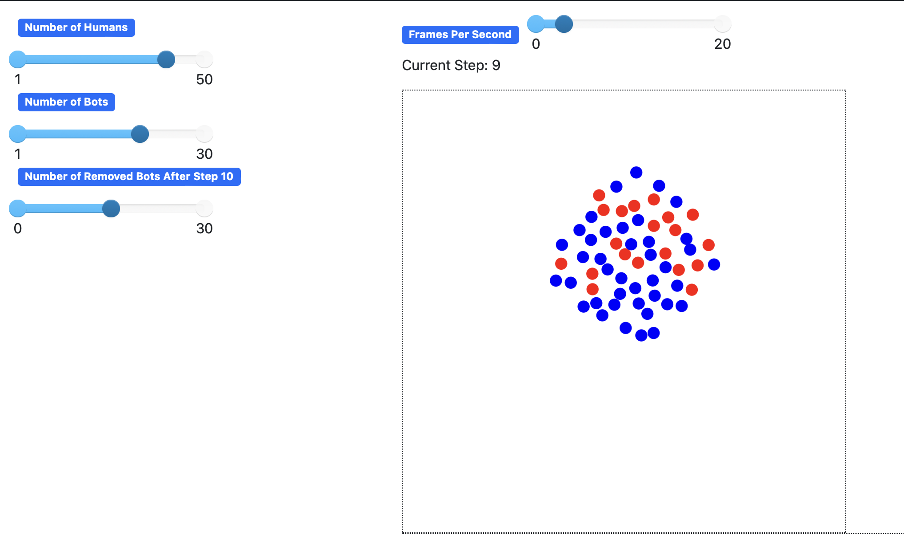

## Key Observations at Different Simulation Stages

### Figure 1 & 2 (Step 9)

- In the early stage of the simulation, **bots (red)** and **humans (blue)** actively interact within the network.
- The graphs show that **bot engagement increases much faster** than human engagement, indicating that bots initially dominate content amplification.
- Additionally, **Average Bot Influence** is already significantly higher than human influence, highlighting bots’ strong impact on content visibility.

---

### Figure 3 & 4 (Step 30)

- After **Step 10**, a user-defined number of **bots are deactivated (gray)** and no longer participate in the simulation.
- This change is reflected in the graphs — **bot engagement growth flattens**, while **human engagement continues to rise steadily**.
- **Average Human Influence** gradually approaches that of bots, showing a shift toward organic, human-driven interactions.

---

### Figure 5 & 6 (Step 101)

- Over time, **bot engagement slows down**, while **human influence and participation continue to grow**.
- These trends suggest that **while bots initially drive engagement**, humans eventually take over **content dynamics** in the long run.

---

## Planned Enhancements

- **Expand Influence Metrics**  
  Track how long bot-driven content remains influential and measure content spread over time.

- **Enhance Bot Behavior Modeling**  
  Implement strategies like **targeting influential users** and **clustering bots** to simulate coordinated influence.

- **Advanced Visualizations**  
  Add **influence heatmaps**, **engagement change timelines**, and **scenario-based comparison graphs**  
  (e.g., with bots / partial removal / no bots) for deeper analysis.
