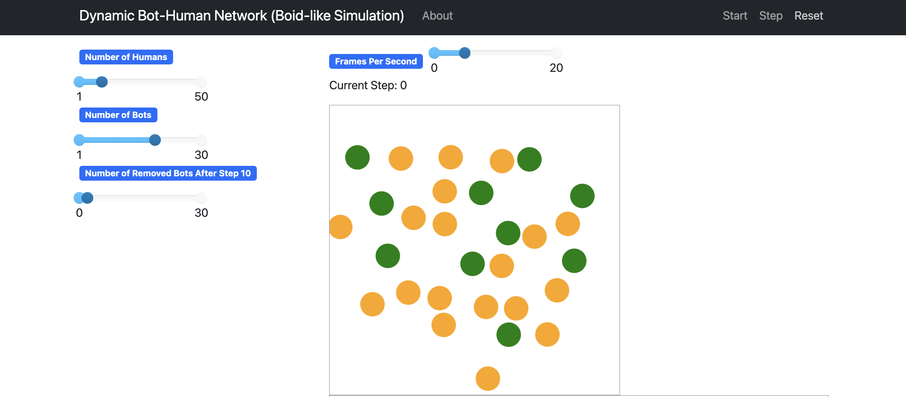
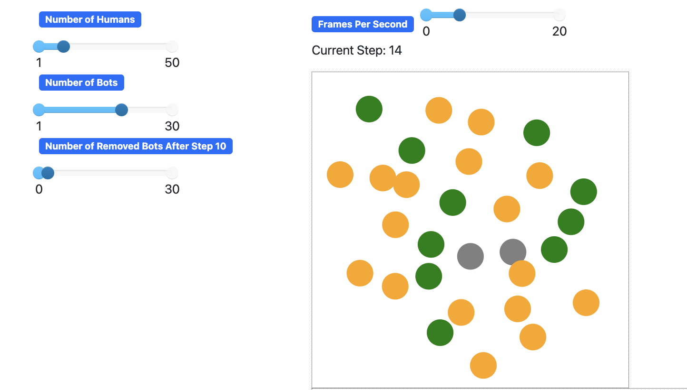
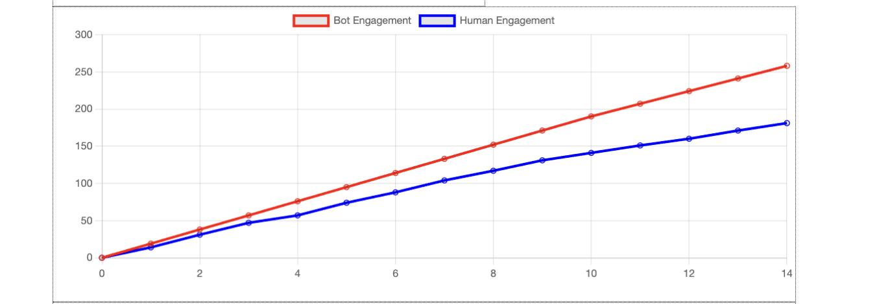
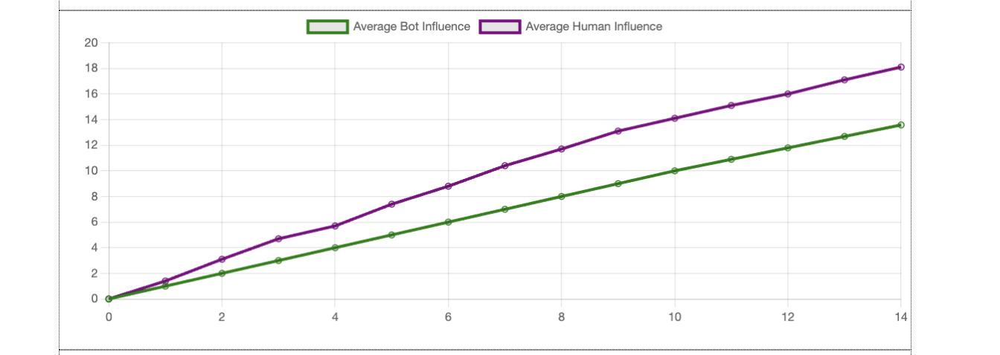
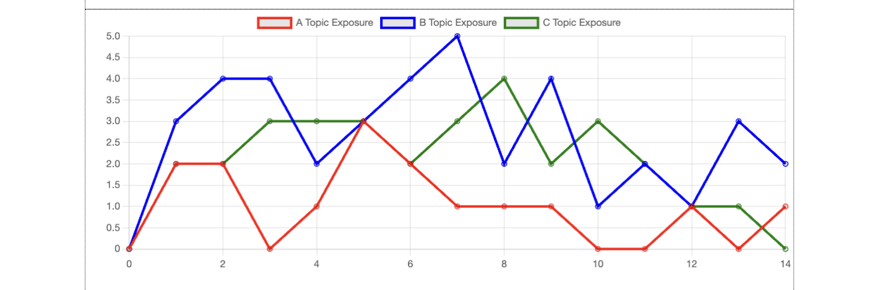
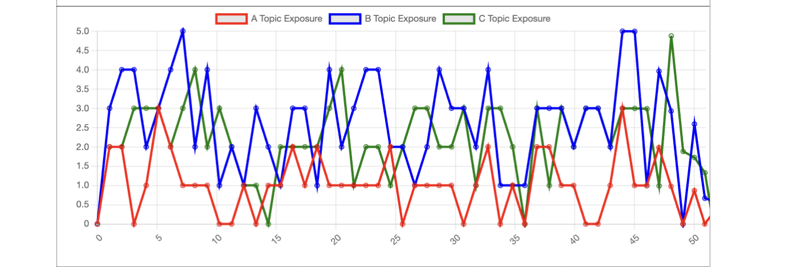

# Deliverable 4: Coordinated Bot Influence in Media Ecosystems

## §1. Phenomenon Overview

### 1.1 Context & Significance  
Our project simulates how groups of coordinated bots can manipulate content visibility, shape public opinion, and change the flow of information within digital media ecosystems. Inspired by **Boid Flocking Theory**, we apply principles like alignment, cohesion, and separation to simulate bot coordination strategies. Bots in our model amplify narratives and suppress opposing viewpoints, creating an illusion of organic popularity. This phenomenon challenges the fairness and authenticity of online conversations by distorting algorithmic visibility and public perception.

### 1.2 Problem Statement  
The simulation examines how bots influence human engagement and content visibility. Bots increase likes or comments on targeted content, skewing what humans see and engage with. We explore how varying the ratio of bots to humans affects overall influence.

### 1.3 Why Agent-Based Modeling (ABM)  
- **Individual Decision-Making**: Models both humans and bots as independent agents.  
- **Emergent Behavior**: Captures complex group outcomes from simple rules.  
- **Scenario Flexibility**: Enables testing of bot-to-human ratios in a controlled environment.

### 1.4 Visual Illustration of the Phenomenon

- **Figure A** – Timestep 0: Bots (red) and humans (blue) actively interact.
 
- **Figure B** – Timestep 14: Deactivated bots shown in gray after step 10.
 
- **Figure C** – Graph: Bot engagement rises rapidly, then flattens post-deactivation while human engagement grows.
  
- **Figure D** – Graph: Initial bot influence is higher; human influence rises after bots are removed.
  
- **Figure E** –
  
- **Figure F** –

---

## §2. Simulation Design & Implementation

### 2.1 System Overview  
Simulated media ecosystem with two agent types:
- **Bots**: Amplify specific content.
- **Humans**: Passively engage, biased toward visible content.  
Network consists of:
- **Nodes**: Agents (bots/humans).  
- **Edges**: Potential interactions, with weighted influence strength.

### 2.2 Simulation Environment  
- **Frameworks**: Mesa (agent-based modeling), NetworkX (graph structure).  
- **Features**:
  - Erdős-Rényi graph model  
  - Dynamic edge weights (0.1–1.0)  
  - Visualized with agent color and edge thickness  
- **Parameters**:
  - Total agent count  
  - Bot/human ratio  
  - Bot removal after step 10  
  - Influence depends on random draw < edge weight

### 2.3 Agent Design

**Bot Agents** (inspired by Boid Theory):
- **Alignment**: Bots synchronize strategies.
- **Cohesion**: Cluster near humans for visibility.
- **Separation**: Avoid oversaturation by spreading out strategically.

**Human Agents**:
- Passively engage with amplified content.
- More likely to interact with boosted items.

**Simplifications**:
- One interaction per step  
- No content veracity/fact-checking

### 2.4 Interaction Dynamics  
- **RandomActivation** scheduler: Random agent order each step  
- **Bot-to-Human**: Influence via edge weight probability  
- **Bot-to-Bot**: Create reinforcement loops (amplification patterns)  
- **Post-step-10**: Bots removed

### 2.5 Data Collection & Visualization  
- **Metrics**:
  - Total Engagement (bots vs humans)  
  - Average Influence per agent  
- **Visualization Tools**:
  - Network graph (agent type & edge weight)  
  - Engagement chart (bot vs human over time)  
  - Influence chart  
- **Challenges**:
  - Accurate influence scaling  
  - Visualization clarity with large agent counts

---

## §3. Observations & Results

### 3.1 Key Findings  
- **Amplification Disparity**: Bots have higher influence per agent.  
- **Initial Surge**: Bots dominate in early steps.  
- **Removal Effect**: Human engagement increases after bot deactivation.  
- **Bot Clustering**: Enhances effectiveness by embedding near humans.

### 3.2 Data Highlights  
- **Chart 1**: Bots dominate engagement early; humans catch up post-removal.  
- **Chart 2**: Higher bot influence; gradual rise in human influence.  
- **Network Graphs**:
  - Step 5: Bots dispersed  
  - Step 10: Bots begin clustering  
  - Step 15: Shift post-removal

### 3.3 Unexpected Behaviors  
- **Echo Chambers**: Repeated targeting of the same users  
- **Influence Imbalance**: Some bots dominate due to edge weight

### 3.4 Interpretations  
- Algorithms can be manipulated by fake engagement.  
- Even small bot groups can shift content visibility.  
- Bot influence lingers post-removal, delaying normalization.

---

## §4. Ethical & Societal Reflections

### 4.1 Ethical Considerations  
- Bots manipulate engagement metrics.  
- Simulations could be misused for malicious strategy testing.  
- While no real data is used, simulated influence demonstrates potential public manipulation.

### 4.2 Societal Implications  
- **Micro**: Users unknowingly engage with bot-promoted content.  
- **Meso**: Platforms amplify manipulated content, warping discourse.  
- **Macro**: Elections, protests, and public health debates can be distorted.  
- **Repurposing Risk**:  
  - Simulations can train detection or exploitation.  
  - Emphasizes need for algorithm transparency.

---

## §5. Lessons Learned & Future Directions

### 5.1 Design Reflections  
**Challenges**:  
- Mapping edge weight to influence  
- Simulating strategic clustering  
- Managing visual clutter  

**Successes**:  
- Emergent behavior  
- Visualized amplification loops  

### 5.2 Limitations  
- Simplified agent decision models  
- No content type variance  
- Single spread method (resharing only)

### 5.3 Future Improvements  
- Add content types: truthful, fake, inflammatory  
- Resistance traits for humans  
- Bot diversity (spammer vs infiltrator)  
- Use anonymized real-world data  

### 5.4 Future Applications  
- **Policy**: Inform platform moderation strategies  
- **Detection**: Flag bots through activity patterns  
- **AI Governance**: Create rules and transparency for AI-driven influence  

---

## §6. References  
- Bessi, A., & Ferrara, E. (2016). *Social bots distort the 2016 U.S. presidential election online discussion*. First Monday, 21(11). [DOI](https://doi.org/10.5210/fm.v21i11.7090)  
- Stella, M., Ferrara, E., & De Domenico, M. (2018). *Bots increase exposure to negative and inflammatory content in online social systems*. PNAS, 115(49), 12435–12440.  
- Varol, O., Ferrara, E., Davis, C., Menczer, F., & Flammini, A. (2017). *Online human-bot interactions: Detection, estimation, and characterization*. ICWSM, 280–289.

---

## §7. Attestation  
We confirm all members contributed meaningfully to the report.

- **Sanchita Chowdhury (219195841)**  
  *Roles*: Conceptualization, Software, Writing - Original Draft, Visualization  
  *Contributions*: Developed simulation logic, refined visualizations, wrote and edited report  

- **Peng Qiu (218419598)**  
  *Roles*: Investigation, Writing - Review & Editing, Validation  
  *Contributions*: Literature research, simulation testing, results analysis, report editing  

- **Hyunji Yun (217968801)**  
  *Roles*: Formal Analysis, Data Curation, Project Administration  
  *Contributions*: Ran simulations, curated data and visuals, ensured content cohesion  
